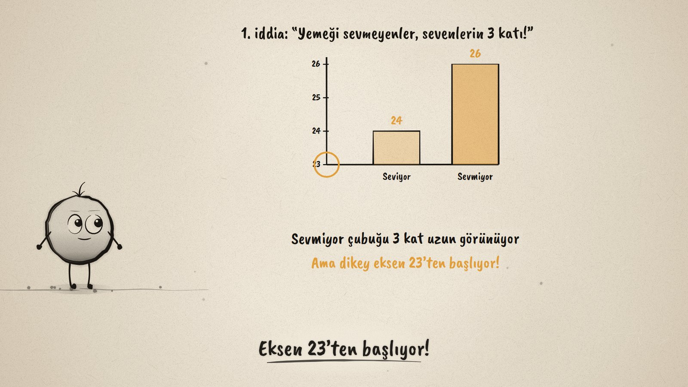
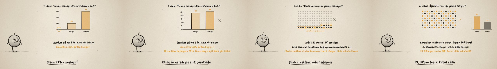

# İddiayı Sına · Questioning Statistical Claims

**▶ Tarayıcıda izleyin / Watch in the browser:** https://hakanatas.github.io/iddiayi-sina/ 
**⬇ MP4 + altyazılar / MP4 + subtitles:** [Releases](https://github.com/hakanatas/iddiayi-sina/releases) 
**✎ Kullanılan istem / The prompt behind it:** [PROMPT.md](PROMPT.md) 
**🎞 Bütün filmler / All films:** [Nokta'nın Filmleri](https://hakanatas.github.io/nokta-filmleri/?sinif=6)

> **TR —** 6. sınıf matematik "İstatistiksel Araştırma Süreci" temasındaki MAT.6.5.2 öğrenme çıktısı için hazırlanmış, tamamen JavaScript ile çizilen 92 saniyelik mürekkep animasyonu. Okul gazetesinde yemekhane üzerine üç iddia sınanıyor. Birinci iddia ("Yemeği sevmeyenler, sevenlerin 3 katı!"): grafikte sevmiyor çubuğu 3 kat uzun görünüyor ama dikey eksen 23'ten başlıyor; eksen 0'dan başlayınca 24 ile 26 neredeyse eşit, iddia çürütülüyor. İkinci iddia ("Okulumuzun çoğu yemeği sevmiyor!"): 120 kişilik okulda ankete yalnızca yemekhane kuyruğunun sonundaki 20 kişi katılmış; yanlı örneklem, iddia kabul edilemiyor. Üçüncü iddia ("Öğrencilerin çoğu yemeği seviyor."): her sınıftan eşit sayıda 60 öğrenci, 39 seviyor, eksen 0'dan başlıyor; 39, 60'ın yarısından fazla, iddia kabul ediliyor. Son olarak dört soruluk bir kontrol listesi: kime soruldu, örneklem temsil ediyor mu, eksen 0'dan başlıyor mu, sayılar iddiayı destekliyor mu? Altyazılar Türkçe, İngilizce ya da ikisi birlikte seçilebilir.

A 92-second ink animation for **6th-grade maths**, the last film of the fifth 6th-grade theme. Nokta, the ink character from [The Learning Ink](https://github.com/hakanatas/the-learning-ink), is the guide again. The misleading chart is not a separate picture: the same bars are redrawn while the axis minimum slides from 23 to 0 (`chart1` in `scenes/scene1.js`), so the 1 : 3 look melts into 24 : 26 on screen.

## Learning outcome

MEB, Türkiye Yüzyılı Maarif Modeli, Ortaokul Matematik, 6th grade, "İstatistiksel Araştırma Süreci" theme:

**MAT.6.5.2. Başkaları tarafından oluşturulan kategorik veya nicel (kesikli) veriye dayalı istatistiksel sonuç veya yorumları tartışabilme**
- a) Başkaları tarafından oluşturulan kategorik veya nicel (kesikli) veriye dayalı istatistiksel sonuç veya yorumlara yönelik istatistiksel temellendirme yapar.
- b) Başkaları tarafından oluşturulan kategorik veya nicel (kesikli) veriye dayalı istatistiksel sonuç veya yorumlara yönelik hataları ya da yanlılıkları tespit eder.
- c) Başkaları tarafından oluşturulan kategorik veya nicel (kesikli) veriye dayalı istatistiksel sonuç veya yorumları çürütür ya da kabul eder.

## Scenes

| # | Time | Scene | What happens | Outcome |
|---|---|---|---|---|
| 1 | 0–10 s | Üç iddia | Three claims in the school paper: test before accepting. | a |
| 2 | 10–28 s | Yanıltıcı grafik | An axis from 23 makes 24 : 26 look like 1 : 3; from 0 they are almost equal. Refuted. | a, b, c |
| 3 | 28–46 s | Yanlı örneklem | Only the last 20 in the lunch queue were asked; the sample does not represent the school. | b, c |
| 4 | 46–64 s | Sağlam iddia | 60 students from every class, 39 like it, axis from 0: more than half. Accepted. | a, c |
| 5 | 64–80 s | Sorular | Who was asked? Representative? Axis from 0? Do the numbers support it? | a, b, c |
| 6 | 80–92 s | Aklında kalsın | Refute or accept by the evidence. | c |

## Running it

- **Preview:** double-click `index.html` (it works offline).
- **MP4:** run `npm install` once, then `npm run export -- --format=horizontal --captions=tr`.
- **Subtitles and narration:** `npm run srt` writes `out/captions_*.srt` and `narration_notes.txt`.
- **Editing:**
  - Caption text, timings and narration notes: `captions.js`
  - Everything on screen is drawn by `LI.world(t)` in `scenes/scene1.js` (the chart, the school of 120 dots and its two samples, the checklist, the words); the other scenes only set the camera.
  - Nokta's poses: `src/draw/film.js`; layout for 16:9 and 9:16: `src/draw/kd.js`

It uses the same engine as The Learning Ink: `renderFrame(t)` as a pure function of time, seeded randomness, and frame-by-frame export.
